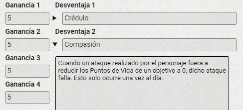

<h1 align="center">Shinobi Tierras Ocultas for Foundry VTT</h1>

## Overview.

An implementation of the Shinobi Tierras Ocultas game system for [Foundry Virtual Tabletop](http://foundryvtt.com). This provides sheets and system in addition to some compendiums as examples.

If you have any suggestions or feedback, please visit us on Discord in the `#shinobi` channel on the [Ex Regnum Publishing Discord Server](https://discord.gg/S8n9Vb8kv2).

We are working on a CHANGELOG file currently.

### Disclaimer.

This project doesn´t contains all the materials from the original book. You will need to create items from the charts by yourself, but contains some gear as examples. [WIP]

## Usage.

Install in Foundry VTT from the Game Systems tab, using the following manifest:
`https://github.com/Bicefalas/Foundry-Shinobi/raw/main/system.json`

- Compendium contains armors, weapons, classes, objects, roll tables, techniques and yokais that you can use to create a new game. Not all of the compendium is ready yet, so you can find only a few examples.

- Every kind of object has a different template, so the type of item you choose will change the information shown in the sheet. Some of the values are already autocalculated, like the damage chart of the weapons.

- To create a Yokai you can select Yokai type in the actor creation popup. It contains the esential information to create a yokai efficiently, also contains autocalculated values and rollable fields to ease the creation and the game.

- To create a Character or standard NPC you can select Shinobi type in the actor creation popup. This sheet has all the information you need to create easily a shinobi. Depending of the class you choose you will see uniques fields and tabs for that class and the values change dinamically dependign of the class and level of the character.

- > In Shinobi Tierras Ocultas a lot of the characteristics and attributes values change depending of other values, for example, life points depends on the class, level and constitution modifiers (and others). Even if the values are already autocalculated, you can modify the final value by the others fields.

- > Some values are hidden while the player don´t need access to them. They can be displayed clicking on the triangle. The status of the dropdown (opened/closed) doesn´t reset by itslef so the player have the option to maintain it open until he closes it manually. This info is saved on the players browser.

- > If you already create an item or technique you can simply drag and drop on the sheet you want to add it to the specific table of that type of object.

## Contributing.

This project has been done by Bicefalas, that's me. The motivation for this project comes from my work at Ex Regnum. I have been working on a Shinobi expansion book, and I realised on the testing plays that is very tedious to create and level up a character. So this system will ease and make it funnier to play.

## Licenses.

All the code on this repository is licensed under the [Creative Commons Attribution-NonCommercial-ShareAlike 4.0 International](./LICENSE.md).

Foundry VTT support is covered by [Limited License Agreement for Module Development](https://foundryvtt.com/article/license/).

This project has used Boilerplate system from Asacolips as a base [Boilerplate System GitHub](https://gitlab.com/asacolips-projects/foundry-mods/boilerplate)

> Permission is given for users to make limited derivative use of this publication for personal use on the Foundry VTT platform. No rights for any commercial use are granted. No part of this publication may be reproduced or distributed for use outside of the Foundry VTT platform.